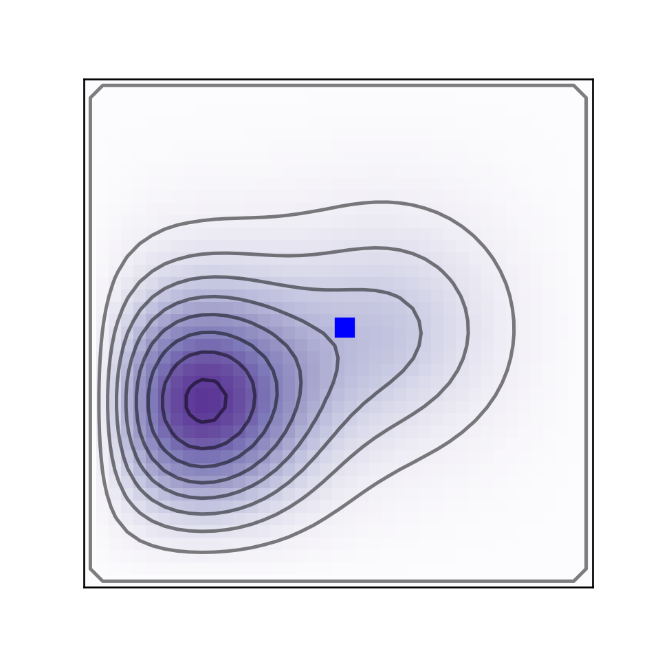
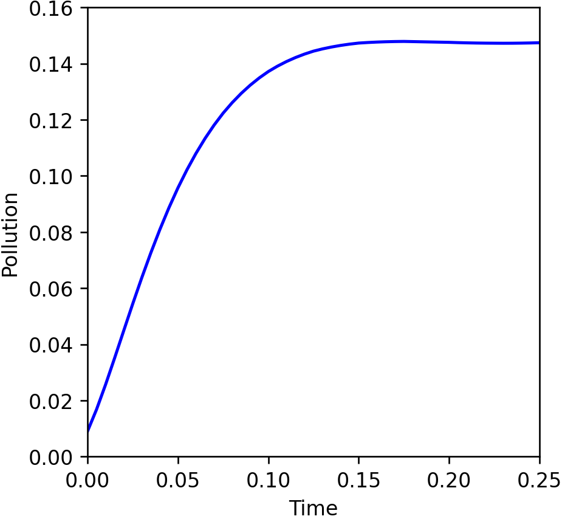

# advectiondiffusion-jax
Solve the advection diffusion equations looped into an optimization problem with JAX/autodiff

## Create Your Own Automatically Differentiable Simulation (With Python/JAX)

### Philip Mocz (2024) Flatiron Institute, [@PMocz](https://twitter.com/PMocz)

### [📝 Read the Algorithm Write-up on Medium](https://philip-mocz.medium.com/create-your-own-automatically-differentiable-simulation-with-python-jax-46951e120fbb)

Simulate the advection-diffusion equations with finite difference and calculate gradients automatically with JAX,
in order to find which simulation input parameters lead to 'worst-case' pollution scenario.


Run the code in the command line with:

```console
python advection_diffusion.py
```

Simulation result:



'Worst-case' pollution scenario:

